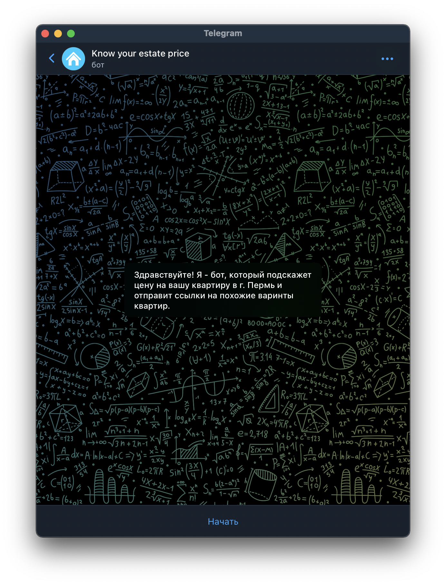
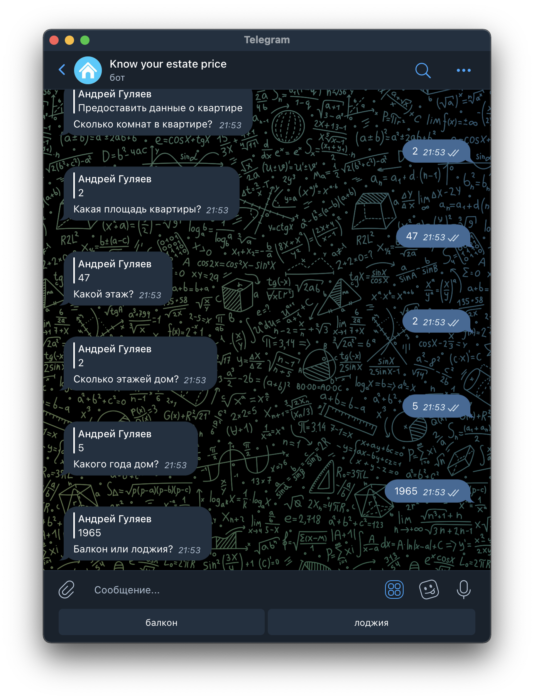
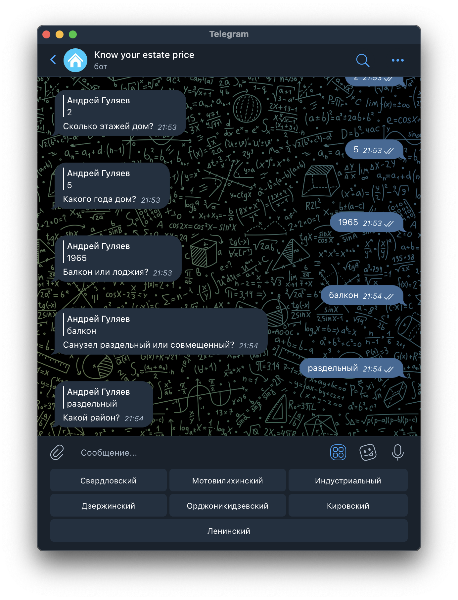
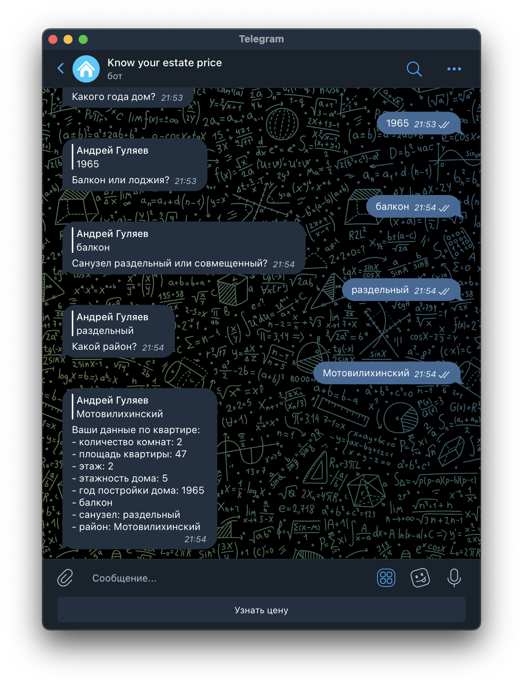
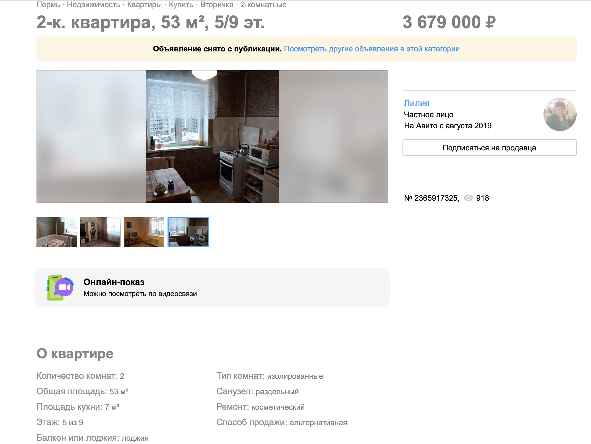

# Avito
Описание пет-проекта.

## Цель:
- Отправка сообщения, содержащего прогнозную рыночную стоимость жилой недвижимости в зависимости от переданных параметров квартиры, пользователю используя телеграм-бот.

## Задачи:
1. парсинг данных с avito.ru и создание датасета;
1. обработка датафрейма;
1. подготовка и отбор признаков к моделированию;
1. построение модели и ее корректировка;
1. развертывание модели в тг-боте.

## Этапы:
1. [*Парсинг данных и создание датасета*](/Parsing-and-creating-df.ipynb)
1. [*Feature engineering и построение модели*](/FE-and-ML.ipynb)
1. [*Создание тб-бота*](/tg-bot.ipynb)

### Результат 1 этапа *Парсинг данных и создание датасета*
Получен датафрейм [database.csv](/database.csv)

### Результат 2 этапа *Feature engineering и построение модели*
Сохранены две модели для [прогнозирования цены](/model_price.pkl) и [подбора ссылок на похожие объекты](/model_links.pkl)
Сохранены датафреймы для использования их на следующем этапе. [Датасет](/database_with_district.csv) для прогнозирования цены и [датасет](/database_with_links.csv) для отправки ссылок

### Результат 3 этапа *Создание тб-бота*
Рабочий тг-бот для прогнозирования цены и отправки ссылки на похожие объекты
|  |  |
| :---: | :---: |
|  |   |
|  |   |
|  |   |

